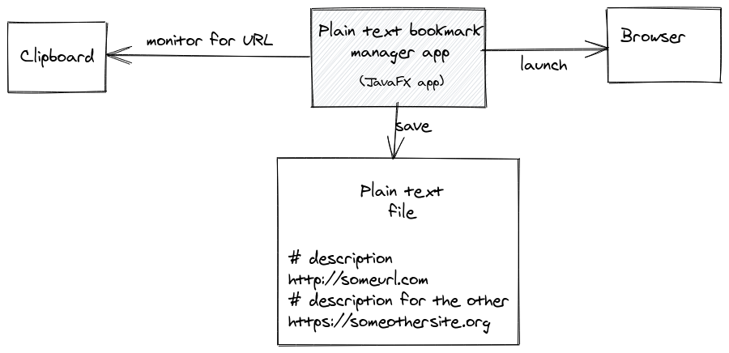
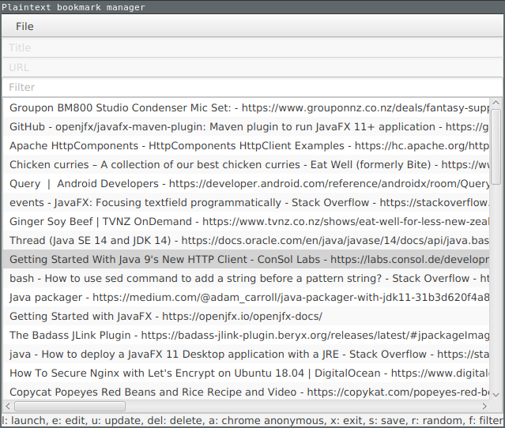

# Plain text bookmark manager

The default bookmark file is ~/.mybookmarks

But you can specify the file location as a parameter when launching the tool.



## Download

Download Linux Debian/Mint/Ubuntu and Windows packages [here](https://github.com/bro1/bookmarkmanager/releases/latest)

## File format

File format looks like this:
```
# CNN lite
http://lite.cnn.com/en
# Text-Only NPR.org
https://text.npr.org/
```


## Screenshot



## For developers

This is how to build it on Linux:

```
mvn clean install
bash repl.sh
```

